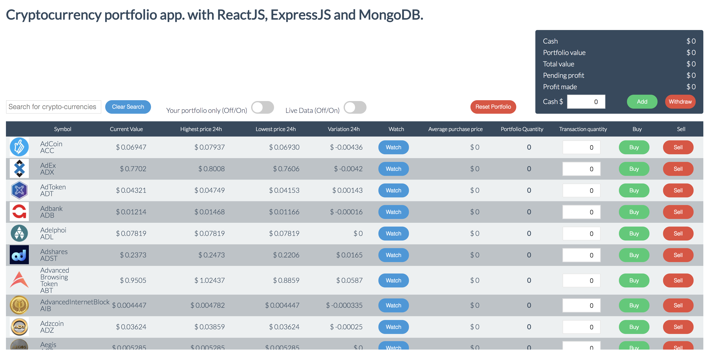
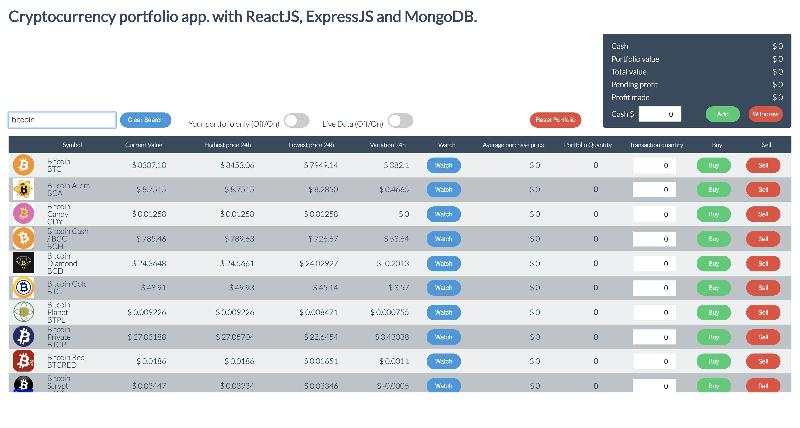
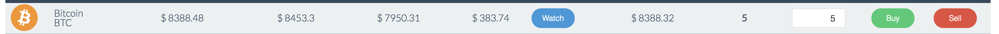
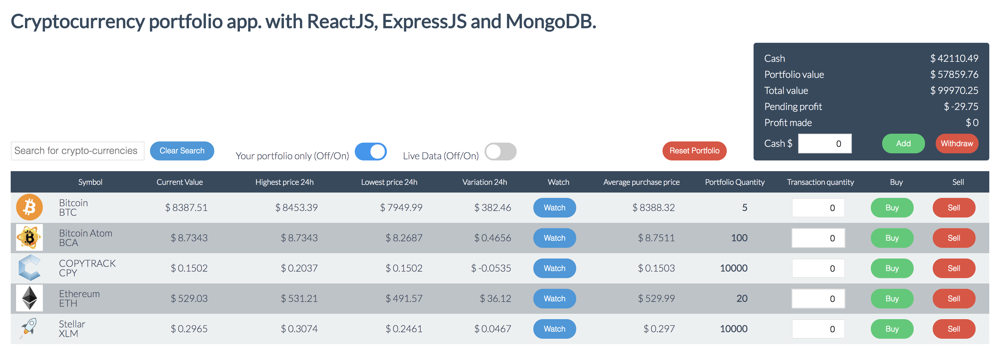
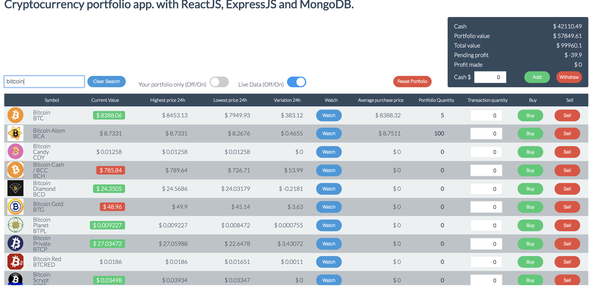
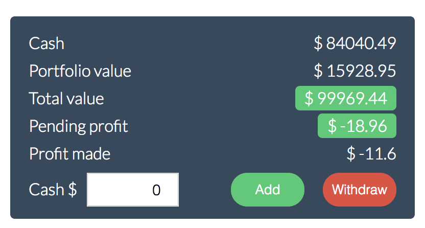

# A 4-day project to build a cryptocurrency portfolio application from scratch

## At a glance
This application aims at providing :
- A list of cryptocurrencies with their realtime values.
- A wallet to manage buy/sell actions on cryptocurrencies

## Technical stack

- Frontend : HTML 5 + CSS 3 + ReactJS
- Backend : ExpressJS with the Cryptocompare API (https://www.cryptocompare.com/api/)
- Data persistence : MongoDB

## Description

### List of cryptocurrencies
Cryptocurrencies can be searched by name or code

Buy/Sell actions can be performed from the list

### Lock on the search on portfolio cryptocurrencies
An option allows to lock the search only on the cryptocurrencies that the portfolio contains

### Live data "On/Off"
- LiveData can be activated to get the realtime values of cryptocurrencies and the wallet
- All the values which increase/decrease are highlighted in green/red

### Wallet
- Cash can be added to the wallet to buy crytocurrencies
- Cash can also be withdraw from the wallet
- When a purchase/sale on cryptocurrencies is performed then the wallet is updated
- The pending profit represents the profit which would be made if the currencies of the portofio were sold

